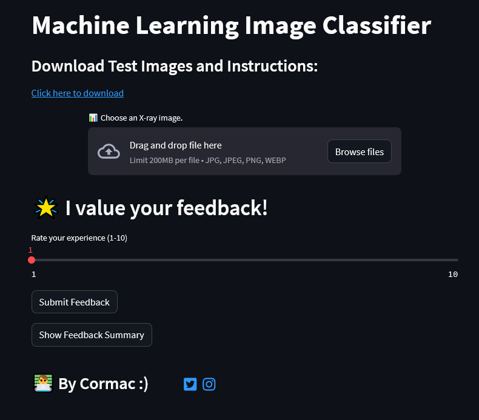

# machine-learning-app

*This project was developed with the help of AI tools, using them as a guide, assistant, and for significant code generation. All final creative decisions and deployments reflect my own work and intentions.*

X-Ray Image Classifier
An intuitive and user-friendly web application developed using Python & TensorFlow to classify images and identify if they indicate the presence of pneumonia.

X-Ray Classifier Demo

Features
1. Upload & Visualize: Easily upload X-ray images and get a visual preview.

2. Instant Prediction: The app uses a trained deep learning model to make instant predictions on the uploaded images.

3. Feedback System: Users can provide feedback on the predictions, aiding in iterative improvement.

4. Feedback Summary: Users can view a summary of the feedback received for the application.

Live Demo
The application is hosted on Streamlit. Check out the live app here: https://cmac-ml.streamlit.app

    Python==3.11.4
    streamlit==1.25.0
    keras==2.13.1
    numpy==1.24.3
    Pillow==9.5.0
    h5py==3.9.0
    tensorflow-cpu==2.13.0
    pandas==2.0.3

Usage
Simply upload an X-ray image using the file uploader. The app will display the image, make a prediction, and present the results. Users are encouraged to provide feedback on the prediction.
Built With

    Streamlit - The web framework utilized.
    TensorFlow/Keras - Employed for deep learning and predictions.
    SQLite - Used for storing and summarizing user feedback.

License
Distributed under MIT. See LICENSE for more information.

Contact

https://www.linkedin.com/in/cormac-farrelly-b080b9279/

https://twitter.com/Cmac_GN

https://www.instagram.com/cmac_987/

Project Repository: https://github.com/cmac-ire/machine-learning-app
